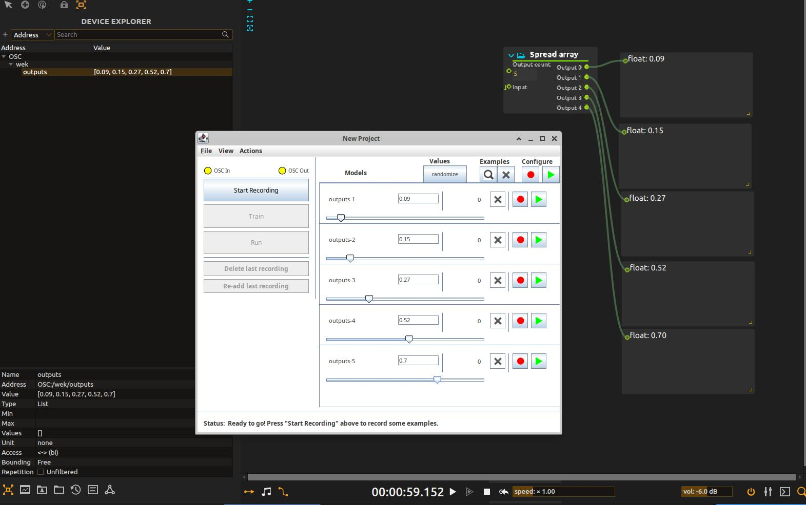

# Computer Vision + OSC — Intermedia Arts Workshop

## What this is

This repo is a starting pipeline for building a **creative digital instrument**: you move in front of a camera, and that movement ends up controlling sound, visuals, lights, or anything else you can imagine — through machine learning, without you having to write any ML code yourself.

It's built from three pieces of software, each doing one job, talking to each other over the network on your own computer:

```
  Webcam
    |
    v
[1] Computer vision (this repo)          reads your hand or body position
    |  OSC  ->  127.0.0.1 : 9000  ->  /wek/inputs
    v
[2] Wekinator                            learns a mapping from your movement to any output you define
    |  OSC  ->  127.0.0.1 : 12000 ->  /wek/outputs
    v
[3] Ossia Score (or Max/MSP, Pure Data, TouchDesigner...)   turns that mapping into sound, visuals, etc.
```

- **[1] This repo** uses [MediaPipe](https://developers.google.com/mediapipe) to track your hand or body from a webcam feed, and streams the raw coordinates out as [OSC](https://en.wikipedia.org/wiki/Open_Sound_Control) messages.
- **[2] [Wekinator](http://www.wekinator.org/)** is a machine-learning tool built for exactly this kind of work: you show it examples ("when my hand is *here*, I want the output to be *this*"), it trains a model, and from then on it maps your live input to an output in real time — no code required. See the official [detailed instructions](https://doc.gold.ac.uk/~mas01rf/Wekinator/instructions/), or the copy bundled in this repo at [documentation/wekinator-documentation.pdf](documentation/wekinator-documentation.pdf).
- **[3] [Ossia Score](https://ossia.io/)** ([download here](https://ossia.io/score/download.html)) receives Wekinator's output over OSC and lets you patch it into sound, visuals, or anything else it can control. You could just as easily patch Wekinator's output into Max/MSP, Pure Data, TouchDesigner, or any other software that understands OSC.

---

## Understanding OSC, `127.0.0.1`, and ports

Because this pipeline is three separate programs talking to each other, it's worth understanding *how* they talk — this is where most setup problems come from.

- **OSC (Open Sound Control)** is a simple network message format used a lot in creative-coding and media art tools. It's just a way of sending a text address (like `/wek/inputs`) plus a list of numbers, from one program to another.
- **`127.0.0.1`** (also called `localhost`) is a special address that always means "this same computer." Even though the three programs never leave your machine, they still talk over the network stack — it's just a network of one.
- **A port** is like a channel number. Your computer can have many programs listening for network messages at once; the port number is how a message knows which program should receive it. Two programs can't both *listen* on the same port at the same time — but any number of programs can *send* to the same port.

In this pipeline, there are two separate OSC hops, each with its own port:

| Hop | Sends from | Sends to | Address | Port |
|---|---|---|---|---|
| 1 | This repo's scripts | Wekinator | `/wek/inputs` | `9000` |
| 2 | Wekinator | Ossia Score (or other) | `/wek/outputs` | `12000` |

> **Heads up:** Wekinator's own built-in default input port is `6448`, not `9000` — this repo's scripts are written to send on `9000` instead. When you set up your Wekinator project, you must type `9000` into the **input port** field on Wekinator's setup screen so it actually listens where our scripts are sending. The output port (`12000`) *is* Wekinator's default, so you shouldn't need to change anything on that side unless you want to.

---

## Windows — Install

Two other pieces of software need to be on your computer for this to work: **Git** and **Python**. If you've never heard of either, here's what they are and what you need to do about each:

- **Git** is the tool that downloads ("clones") this project from GitHub onto your computer. Windows doesn't include it — you install it once, below, before you can even download this repo.
- **Python** is the programming language the tracking scripts are written in. You do **not** need to install this yourself: `install.ps1` (a script inside this repo) checks for it and installs the correct version automatically. It's just good to know it's there, in case a later error message mentions it.

**Step 1 — Install Git (one time only, skip if you already have it)**

Open File Explorer, click the address bar at the top, type `C:\`, and press Enter. Right-click an empty area of that folder and choose **"Open in Terminal"** (hold **Shift** while right-clicking if you don't see that option). Then run:

```powershell
winget install --id Git.Git -e --source winget --accept-package-agreements --accept-source-agreements
```

`winget` is a Windows built-in app installer, so this doesn't require you to open a browser or click through an installer. Once it finishes, **close this terminal window and open a new one** (the "Open in Terminal" trick again) — this lets your computer notice that `git` is now available.

> Already have Git? Running the command above again won't cause any harm — winget will just tell you it's already installed.

**Step 2 — Go to `C:\` and open a terminal**

Same as above: File Explorer → address bar → type `C:\` → Enter, then right-click an empty area and select **"Open in Terminal"**.

**Step 3 — Run these four commands, one by one**

```powershell
git clone https://github.com/cbicari/c-lab-scripts
Set-ExecutionPolicy Bypass -Scope Process
cd c-lab-scripts
.\install\install.ps1
```

The last line (`.\install\install.ps1`) runs the install script, which does four things for you, in order:

1. Installs Python 3.12 (if you don't already have it)
2. Creates a virtual environment (an isolated folder just for this project's dependencies, so they don't clash with anything else on your computer)
3. Installs all the required dependencies into it
4. **Adds two shortcuts to your desktop** — **Hand Tracking** and **Body Tracking** — so you never have to open a terminal again to run the scripts

That last part is the important one to notice: once this finishes, look at your desktop — you'll see two new icons there. That's how you'll launch the scripts from now on.

**Step 4 — Use the desktop shortcuts**

Just double-click a shortcut to launch. Launching one will automatically close the other. Press **Q** or close the window to stop.

> **Why `C:\` ?** Windows usernames with accented characters (e.g. `Étudiant`) break MediaPipe. Installing at `C:\` avoids this entirely.

---

## Linux / Mac — Install

Same two pieces of software as Windows are needed here too: **Git** and **Python 3**. The difference is that on Linux/Mac there's no `install.ps1` doing the checking and installing for you — this repo doesn't include an install script for these platforms, so you (or your system) need to make sure both are already there before continuing.

The good news: most Linux distributions and Macs already have both, or come close enough that installing them is a single command.

**Step 1 — Check what you already have**

Open a terminal and run:

```bash
git --version
python3 --version
```

If both print back a version number (e.g. `git version 2.43.0`, `Python 3.11.6`), you're set — skip ahead to Step 2. If either says something like "command not found", install the missing one:

**Linux (Debian/Ubuntu, e.g. via `apt`):**
```bash
sudo apt update
sudo apt install -y git python3 python3-venv python3-pip
```

**Linux (Fedora, via `dnf`):**
```bash
sudo dnf install -y git python3
```

**Mac:**
```bash
xcode-select --install
```
This installs Apple's Command Line Tools, a small Apple-provided package that includes both Git and Python 3. Click "Install" if a popup appears, and wait for it to finish before moving on.

> If you use [Homebrew](https://brew.sh/), `brew install git python` works too and is easier to keep up to date.

**Step 2 — Open a terminal in the project folder**

**Step 3 — Run**

```bash
git clone https://github.com/cbicari/c-lab-scripts
cd c-lab-scripts
python3 -m venv venv
source venv/bin/activate
pip install -r install/requirements.txt
```

**Step 4 — Launch a script**

```bash
python scripts/hand_recognition.py
```
```bash
python scripts/mediapipe_body.py
```

Press **Q** or close the window to stop.

---

## Setting up Wekinator (hop 1 → 2)

Run one of the tracking scripts first — Wekinator needs to see incoming messages while you configure it.

On Wekinator's project setup screen, fill in:

| Setting | Value |
|---|---|
| Input port | `9000` |
| Input message (OSC address) | `/wek/inputs` |
| Number of inputs | `63` for hand tracking, `66` for body tracking |
| Output message (OSC address) | `/wek/outputs` (default) |
| Output host / port | `localhost` / `12000` (default) |
| Number of outputs | however many outputs you want to control |

Once your inputs are recognized (you'll see the values move on Wekinator's screen as you move in front of the camera), you can record examples, train, and run — see the [detailed instructions](https://doc.gold.ac.uk/~mas01rf/Wekinator/instructions/) for the record/train/run workflow itself, which this README doesn't repeat.

---

## Patching into Ossia Score (hop 2 → 3)

Get Ossia Score from the [official download page](https://ossia.io/score/download.html) if you don't have it yet.

With Wekinator running and sending output, open Ossia Score and add an OSC device that listens on the same port Wekinator is sending to:

1. Right-click in the **Device Explorer** panel and choose **Add device**.
2. In the Protocols column, pick **OSC**.
3. Fill in the device settings:
   - **IP Address**: `127.0.0.1` (i.e. `localhost`)
   - **Input Port**: `12000` (or whatever port you configured as Wekinator's output port above)
   - **Output Port**: leave as-is — we're only *receiving* here, not sending anything back to Wekinator
   - **Device Name**: optional, name it anything (e.g. `wekinator`)
4. Your new device shows up as a top-level node in the Device Explorer.
5. With Wekinator actively running (not just trained), right-click your new device and choose **Learn**. Ossia will watch the incoming OSC traffic and automatically discover the `/wek/outputs` address for you — no need to build the address tree by hand.
6. Click that discovered address in the Device Explorer to see its live incoming value, then drag it into your patch to map it onto sound, visuals, or whatever else you're controlling.

> **Note:** Wekinator sends every output together in one message — a single `/wek/outputs` address carrying a list of floats, one per output, in the order you defined them in Wekinator — rather than a separate address per output. So the node **Learn** discovers will hold a *list* value (you'll see its `Type` listed as `List` in the Device Explorer's bottom panel), not several individually-named parameters. Step 7 below is how you turn that one list back into separate values you can actually patch around.

### Splitting the output list with "Spread array"

Since `/wek/outputs` arrives as a single list (e.g. `[0.09, 0.15, 0.27, 0.52, 0.7]` for a 5-output Wekinator project), you need something to pull it back apart into individual values before you can send each one to a different destination. That's what the **Spread array** process does.

7. Switch to the nodal/patch view for your interval and drag a **Spread array** process from the Process Library onto it.
8. Set its **Output count** input to the number of outputs your Wekinator project has (e.g. `5` if you defined 5 outputs).
9. Drag the `/wek/outputs` address from the Device Explorer onto the Spread array's **Input** pin.
10. The node now exposes one pin per output — **Output 0**, **Output 1**, ... up to your output count — each carrying a single float, in the same order as `outputs-1`, `outputs-2`, etc. appear in Wekinator (`Output 0` = `outputs-1`, `Output 1` = `outputs-2`, and so on).
11. Wire each `Output N` pin to wherever you want it to go — a different sound parameter, visual parameter, another process — same as any other value in Ossia's nodal view.



*The `/wek/outputs` list (left, Device Explorer) feeding a Spread array node configured with `Output count = 5`, producing five separate float values (right) that match `outputs-1` through `outputs-5` in Wekinator (center), in order.*

> A ready-made example Ossia Score project may be added here later. For now, patching it by hand as above is the version — it'll work regardless of which OS or Ossia Score version you're on, since it doesn't depend on a saved project file at all.

---

## Troubleshooting

**Camera not opening** — Try `detection_context(dev_id=1)` in the script to switch camera.

**`ModuleNotFoundError`** — Your terminal is not using the venv. On Linux/Mac run `source venv/bin/activate` first. On Windows, use the desktop shortcuts instead.

**Slow or laggy** — MediaPipe runs on CPU. Close other heavy applications.

**Wekinator isn't reacting to my movement** — Make sure the input port on Wekinator's setup screen is set to `9000`, not its default of `6448`.

**Ossia Score isn't receiving anything** — Make sure Ossia's OSC device is listening on the same port Wekinator is configured to send output to (`12000` by default), and that Wekinator is actually running (not just trained).
